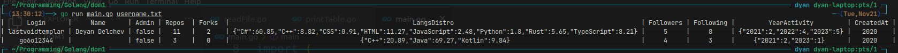

# Golang Github Client ClI

## Summary
This project is homework for Go Course. Its purpose is to retrieve statistics from the public Github API for a list of users given by a text file and printed to the console in a table format.

## Usage

You need:
- Go version 1.21

*The below commands are for Mac/Linux*

You can compile and run:
```
go build -o app main.go
./app username.txt
```
**OR**

You can run it directly:
```
go run main.go username.txt
```

## Example

